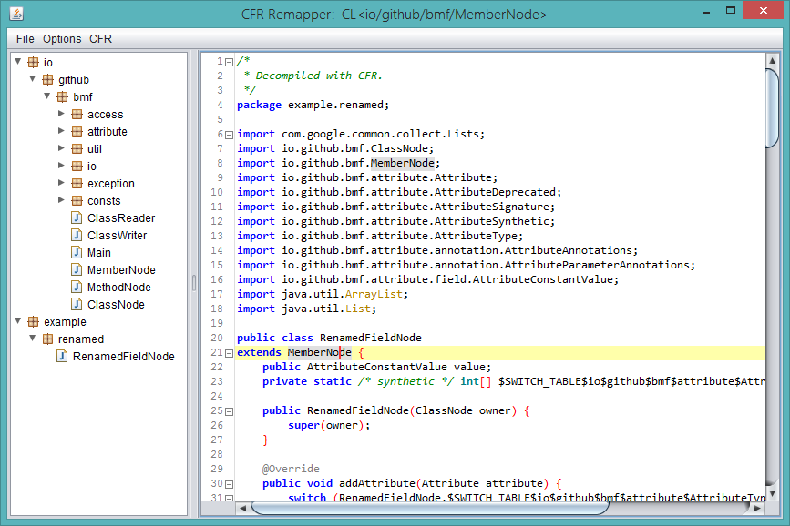

# JRemapper
An easy to use GUI for remapping classes, methods, and fields of compiled java programs.

For information on how to use JRemapper and other details about it, check out [the wiki](https://github.com/Col-E/JRemapper/wiki).

### Download

See the [releases](https://github.com/Col-E/JRemapper/releases) page for the latest build.

### Libraries used:
* [BMF](https://github.com/Col-E/Bytecode-Modification-Framework) - _Remapping abilities_
* [CFR](http://www.benf.org/other/cfr/) - _Java decompiler_
* [RSyntaxTextArea](https://github.com/bobbylight/RSyntaxTextArea) - _Syntax highlighting_

### Screenshot

